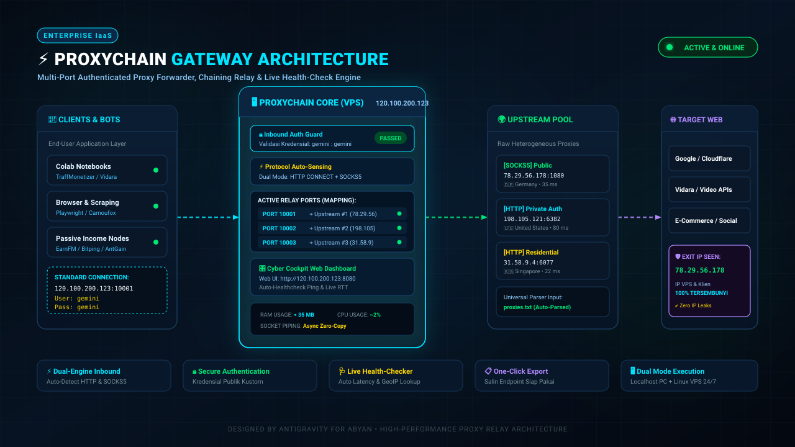

# ⚡ ProxyChain Gateway

> **Multi-Port Authenticated Proxy Forwarder, Chaining Relay & Live Health-Check Engine**

ProxyChain adalah sistem **Proxy Gateway & Forwarding Server** yang mengubah daftar proxy upstream (baik proxy publik gratisan maupun proxy privat berotentikasi) menjadi port-port proxy terpusat dengan format dan otentikasi seragam yang Anda kontrol sendiri:

$$\text{Client / Bot} \longrightarrow \mathbf{HOST:PORT:USER:PASS} \longrightarrow \text{ProxyChain Relay} \longrightarrow \text{Upstream Proxy} \longrightarrow \text{Target Web}$$



---

## ✨ Fitur Unggulan

* **🎛️ Cyber Cockpit Web Dashboard:** Tampilan visual modern (`#070f1a` & `#00e5ff`) untuk mengelola proxy lewat browser tanpa menyentuh terminal SSH.
* **⚡ Protocol Auto-Sensing:** Setiap port proxy otomatis mendeteksi koneksi **HTTP CONNECT** dan **SOCKS5** secara bersamaan.
* **🔒 Inbound Client Authentication:** Melindungi seluruh port proxy dengan username & password kustom Anda (`gemini:gemini`).
* **🩺 Asynchronous Live Health-Checker:** Menguji latency RTT (ms), mendeteksi Exit IP, dan GeoIP negara asal secara real-time.
* **📋 One-Click Export:** Salin seluruh endpoint proxy yang siap pakai dalam 1 kali klik.
* **🖥️ Dual Mode:** Berjalan mulus di **Localhost Windows** dan **Linux VPS 24/7 (Systemd Service)**.

---

## 🚀 Cara Menjalankan di Localhost (Windows)

1. Pastikan Python 3.10+ sudah terpasang.
2. Klik ganda file:
   ```cmd
   run_localhost.bat
   ```
3. Buka browser: `http://127.0.0.1:8080`

---

## ☁️ Cara Deploy ke VPS Linux (Ubuntu / Debian)

Jalankan perintah 1 baris berikut di terminal SSH VPS Anda:

```bash
git clone https://github.com/<USERNAME>/ProxyChain.git proxychain && cd proxychain && sudo bash deploy_vps.sh
```

Service akan otomatis terdaftar di systemd sebagai `proxychain.service`, menyala 24/7 di latar belakang, dan dashboard dapat langsung diakses via:
`http://IP_VPS:8080`
